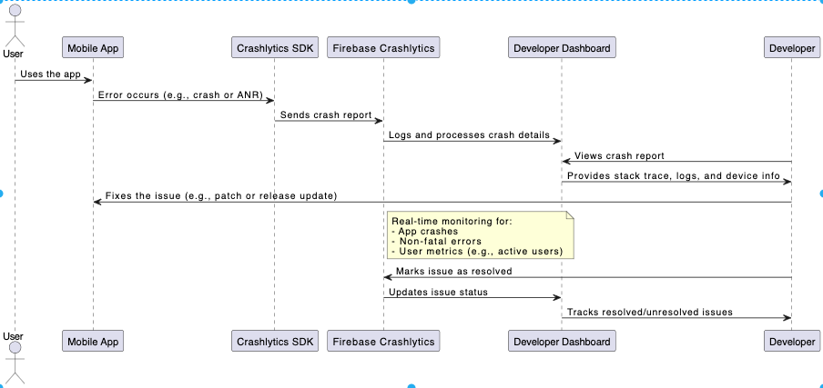

# Innova 2024 Delhi NCR Talk by [Amitesh Mani Tiwari](https://www.linkedin.com/in/appdevbyamitesh)
- **Position**: Software Engineer (iOS Team) at Angel One 👨‍💻.
- **Experience**: Over 35 technical and non-technical talks delivered as a technical speaker 🎙️.
- **Roles**: Hackathon mentor and judge 🏆.
- **Achievements**: Winner of the 21 Under 21 Award 🥇.
- **Upcoming Projects**: Soon-to-be novelist with a novel currently in the publishing phase 📖.

## Overview
Amitesh Mani Tiwari introduces the "InnovaEventManagement" project during the Innova 2024 in Delhi NCR. This application showcases Firebase integration within an iOS app using the MVVM architecture, focusing on features such as user authentication, event listing, and management.

## Dependencies
- **Firebase/Auth**: Handles user authentication.
- **Firebase/Firestore**: Manages real-time database interactions.
- **Firebase/Functions**: Automates backend processes via cloud functions.
- **Firebase/Storage**: Provides file storage solutions.
- **Firebase/Crashlytics**: Offers crash reporting and analytics.
- **Firebase/Analytics**: Tracks app usage and user engagement.
- **FirebaseUI/Auth**: Simplifies UI for authentication.
- **FirebaseUI/Firestore**: Facilitates UI binding for Firestore data.
- **Firebase/Messaging**: Enables push notifications.

### Installation
To install the dependencies, run the following command in the project directory:
```bash
pod install
```
## Architecture
- MVVM 
- Utilizes SOLID principles for robustness and scalability.

### Key Components
- **LoginViewController**: Handles the authentication of users using email and password.
- **RegisterViewController**: Provides registration functionality for new users.
- **EventListViewController**: Displays a list of events, allowing users to add new events.
- **EventViewModel**: Manages interactions with Firestore for event-related data.
- **AuthViewModel**: Oversees all user authentication logic.
- **Cloud Functions Integration**: Automates various tasks like notifications for newly created events and scheduled cleanups of expired events.

### Project Explanation Through Images
1. **User Authentication Flow**:
   - **File**: images/1.png
   - Simplifies user login and registration using Firebase Authentication.
   - Supports multiple authentication methods such as email/password, Google login, and Facebook login.
   - 

2. **Real-Time Data Interaction**:
   - **File**: images/2.png
   - Demonstrates real-time data updates and UI synchronization using Firestore.
   - Ensures seamless data consistency across different user devices.
   - 

3. **Cloud Functions Automation**:
   - **File**: images/3.png
   - Illustrates automation of backend tasks using Firebase Cloud Functions.
   - Automates data validation and sending notifications without managing servers.
   - 

4. **App Scaling and Performance**:
   - **File**: images/4.png
   - Discusses the scalability of Firebase and its serverless infrastructure to maintain smooth user experiences.
   - Highlights the use of Firebase Hosting and Realtime Database for efficient data management and application scaling.
   - 

5. **Error Handling and Monitoring**:
   - **File**: images/5.png
   - Outlines error monitoring and debugging using Firebase Crashlytics.
   - Tracks real-time app performance issues and user metrics to quickly resolve problems.
   - Ensures high reliability and smooth operation of the app.
   - 

## Facing Any Problem or need any Help
Write me in [issues](https://github.com/geekyamitesh/MedBookApp-iOSApp/issues) section. I will try solve your issue within 10-12 hours.
</br>***Keep Developing and Destroying.*** :wink:

<p align="center">
  <i>Take a look at my repositories and let's get in touch!</i>

<p align="center">
<a href= "https://github.com/appdevbyamitesh"></a>
<a href= "https://www.linkedin.com/in/appdevbyamitesh/"></a>
<a href= "https://twitter.com/appdevbyamitesh"></a>
<a href= "https://geekyamitesh.github.io/amitesh/"></a>
</p>

</p>
